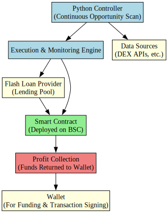

# Another DEX Flash-loan Arbitrage Bot

## What?

Another Dex Flash-loan arbitrage system that:
- is low cost, works on Polygon;
- uses AAVE for flash loans;
- makes use of established patterns when existent;
- prefers open-source tools but does not shy away from freemium services.

## Introduction

Decentralized exchanges (DEXs) often have price discrepancies due to liquidity variations and large trades. This system aims to exploit these discrepancies through flash loans, which allow borrowing large amounts of cryptocurrency without collateral, provided the loan is repaid within the same transaction.

Key features of this system include:
- **Mispricing Exploitation**: Take advantage of mispricing between exchanges. When someone executes a large trade into one liquidity pool, it can create an imbalance, distorting the price and causing slippage for that trader.
- **Smart Contract Relay**: Use a Solidity smart contract as a relay between our controller and the exchanges.
- **Risk Management**: We can revert the entire transaction and only lose the transaction fee if it is not profitable with one line of code: `require(endBalance > startBalance, "Trade Reverted, No Profit Made");`

## Tech Stack

* [Ape](https://apeworx.io) - Development environment for Ethereum software.
* [Alchemy](https://www.alchemy.com/) - Blockchain infrastructure platform.
* [Python](https://www.python.org) - Programming language for scripting and automation.
* [Solidity](https://soliditylang.org) - Programming language for writing smart contracts.

## Outline



## Resources

* Uniswap v2 router-based [smart contract](https://github.com/jamesbachini/DEX-Arbitrage/blob/main/contracts/Arb.sol).
* Based on the [Introduction To DEX Arbitrage](https://jamesbachini.com/dex-arbitrage/) tutorial by James Bachini.

## Getting Started

### Prerequisites

Ensure you have the following installed:
- Python 3.9 - 3.12
- pip
- Ape

### Installation

1. Clone the repository:
    ```sh
    git clone git@github.com:jorgejch/dex-arbitrage.git
    cd dex-arbitrage
    ```

2. Create a virtual environment and activate it:
    ```sh
    python -m venv venv
    source venv/bin/activate
    ```

3. Install dependencies:
    ```sh
    pip install -r requirements.txt
    ```

4. Set up environment variables:
    Create a `.env` file in the root directory and add your configuration based on the `.env.template` file.

### Usage

1. Compile the smart contracts:
    ```sh
    ape compile
    ```

2. Run the tests:
    ```sh
    ape test
    ```

3. Deploy the contracts:
    ```sh
    ape run scripts/deploy.py
    ```

## Contributing

Contributions are welcome! Please open an issue or submit a pull request.

## License

This project is licensed under the MIT License - see the [LICENSE](LICENSE) file for details.