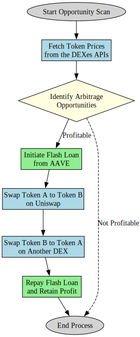

# Strategy

## Overview

- The Python Controller continuously scans for arbitrage opportunities and triggers the smart contracts to execute profitable trades.
- The Python controller uses data sources such as the DEXes APIs to fetch token prices and other relevant information.
- The smart contracts interact with the Flash Loan Provider to borrow funds, DEX A to swap Token A for Token B, and DEX B to swap Token B for Token A.
- As the last step the smart contract repays the flash loan and retains the profit.

